# Red Hat OpenShift Service Mesh Installation Lab

Use the Red Hat OpenShift Service Mesh operator to deploy a multi-tenant Service Mesh

## Setup

Installing the OpenShift Service Mesh involves :

* Install Elasticsearch Operator
* Intall Jaeger Operator
* Install Kiali Operator
* Installing the Service Mesh Operator
* Create project istio-system
* Creating and managing a ServiceMeshControlPlane resource to deploy the Service Mesh control plane
* Creating a ServiceMeshMemberRoll resource to specify the namespaces associated with the Service Mesh.


## Install Operators

**Remark: Instructor already installed all operators for you. This is per cluster activities.**


Login to OpenShift Web Console using Adimin user
* In the OCP Web Console, navigate to: Catalog -> Operator Hub
* In the OperatorHub catalog of your OCP Web Console, type Elasticsearch into the filter box to locate the Elasticsearch Operator (by Red Hat)
     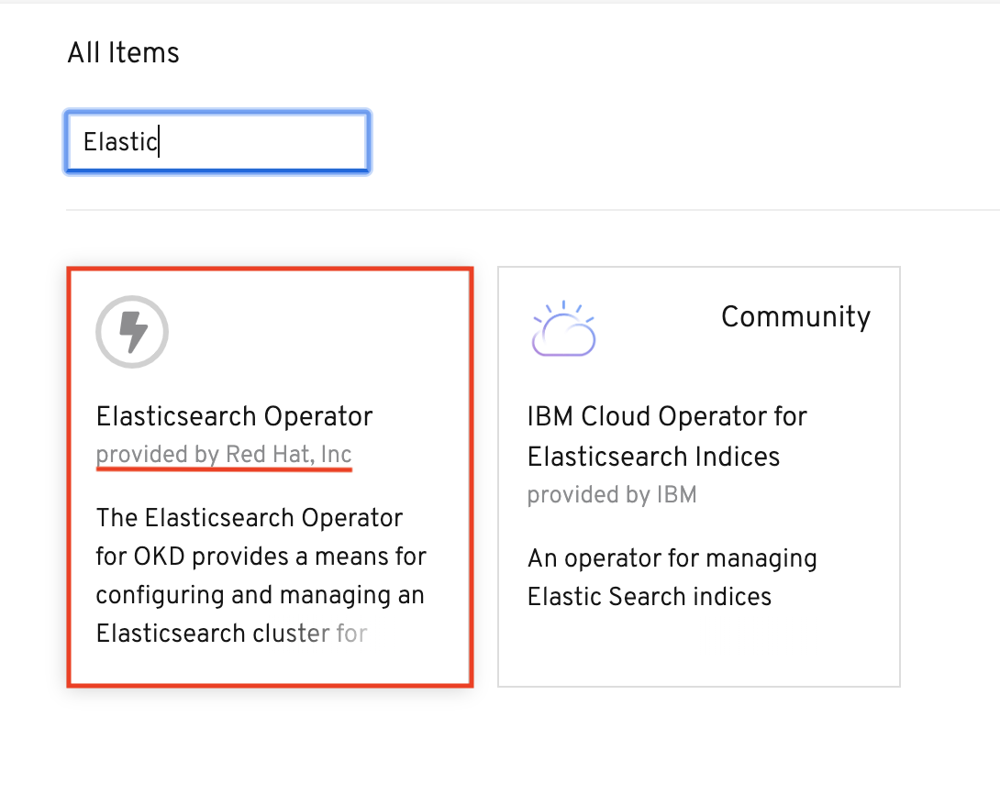
* Click the Elasticsearch Operator to display information about the Operator and Click Install
     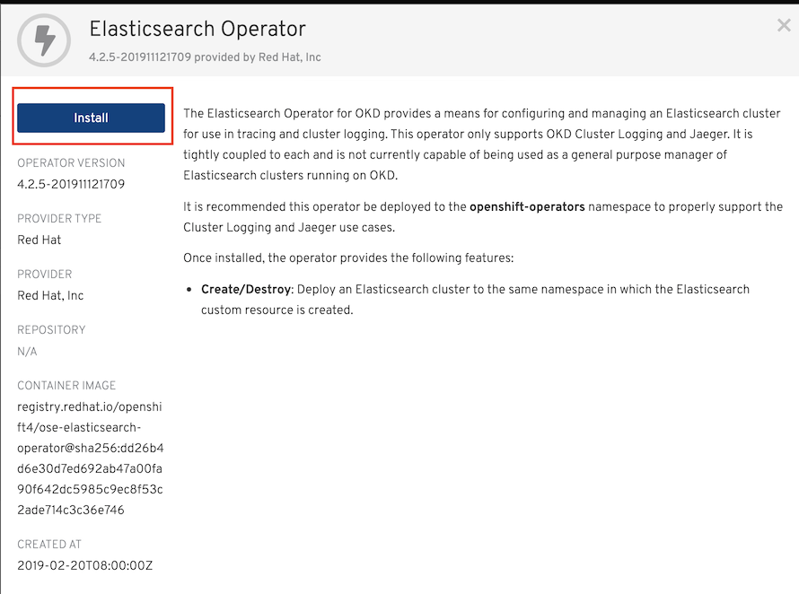
* On the Create Operator Subscription page. Select All namespaces on the cluster (default). This installs the Operator in the default openshift-operators project and makes the Operator available to all projects in the cluster and Click Subscribe
     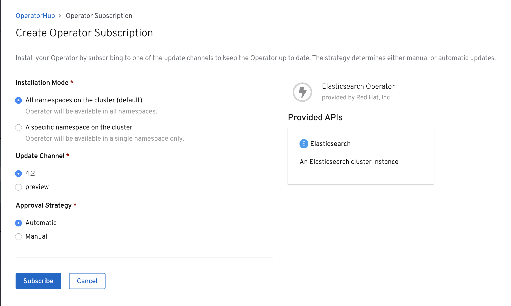 
* The Subscription Overview page displays the Elasticsearch Operator’s installation progress. Following screen show Elasticsearch oprator installed.
     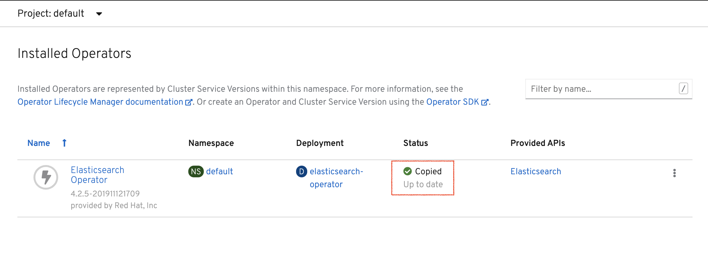
* Repeat all steps for Jaeger, Kiali and OpenShift Service Mesh. **Select Operator that provided by Red Hat not Community version.**
* Following screen show all 4 operators are installed.
     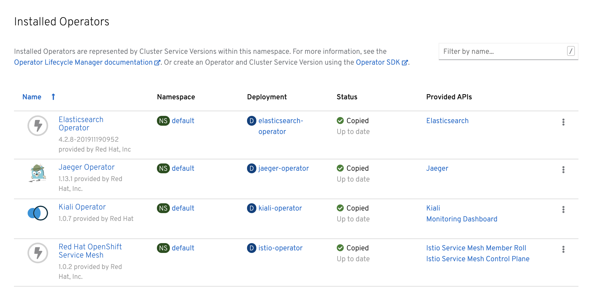

## Setup
There are two microservices in this lab that you will deploy to OpenShift. In a later lab of this course, you will manage the interactions between these microservices using Red Hat OpenShift Service Mesh.

Here is the application architecture of the microservices:

image here!

Setup environment variables
```
export USERID=<your user ID> # or Use set USERID=<your user ID> for Windows CMD


```

Login to OpenShift with oc command by
```
oc login --username=$USERID --server=<URL to OpenShift> # or using %USERID% instead of $USERID for Windows CMD

```

Create project (namespace) for frontend and backend application
```
oc new-project $USERID # or using %USERID% instead of $USERID for Windows CMD

```

Create Project (namespace) by Web Console, select new project from top-left menu
[](../images/create-user-project.png)

Clone project to your working directory
```
git clone https://gitlab.com/workshop6/service-mesh.git

```
If you don't have git, click this [Service Mesh Workshop](https://gitlab.com/workshop6/service-mesh)

Download by click following icon.
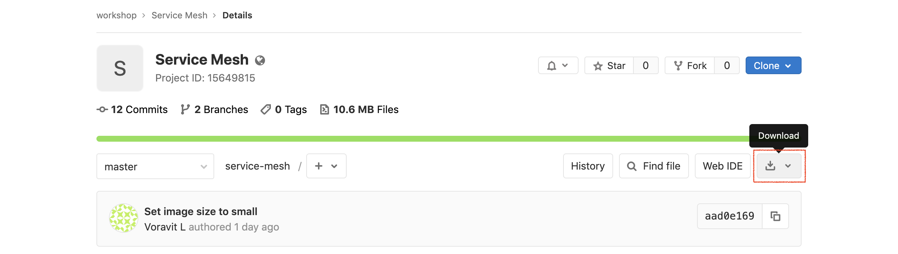


## Service Mesh Control Plane
Now that the Service Mesh Operator has been installed, you can now install a Service Mesh control plane.
The previously installed Service Mesh operator watches for a ServiceMeshControlPlane resource in all namespaces. Based on the configurations defined in that ServiceMeshControlPlane, the operator creates the Service Mesh control plane.

In this section of the lab, you define a ServiceMeshControlPlane and apply it to your **$USERID-istio-system namespace**.

* Create a project (namespace) called **$USERID-istio-system** where the Service Mesh control plane will be installed by using oc command or Web Console
  
  ```
  # Replace USER1 with your user ID
  oc new-project $USERID-istio-system --display-name="User1 Istio System"
  ```

  By Web Console. **Replace user1 with your User ID.
  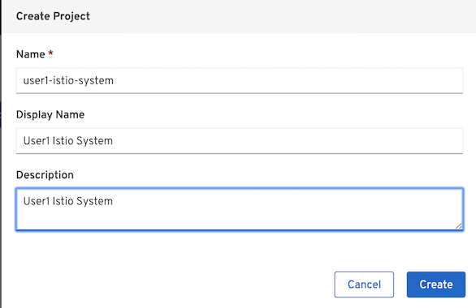
  
* Install Control Plane using the custom resource file [basic install](../install/basic-install.yml)
    Mutual TLS is disbled by setting mtls to false.
    Kiali user is single sign-on with OpenShift
* Create the service mesh control plane in the istio-system project
  By oc command
  ```
  oc apply -f install/istio-installation.yml -n $USERID-istio-system
  ```
  By Web Console, navigate to: Operators -> Installed Operators then select Red Hat OpenShift Service Mesh
  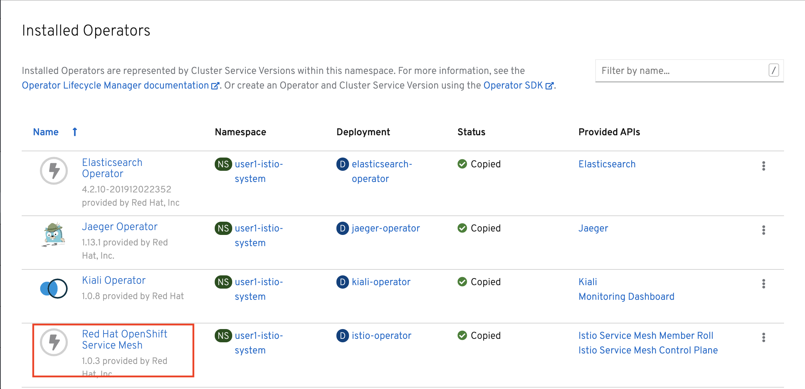

  Select Create Instance under Istio Service Mesh Control Plane
  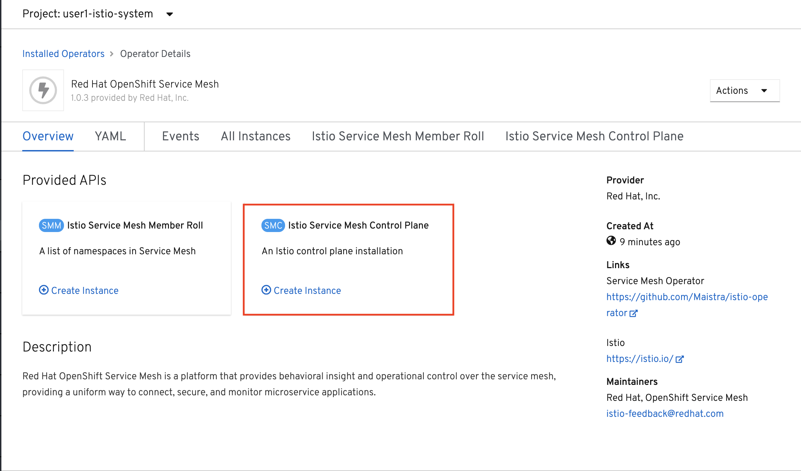

  Copy and paste custom resource file [basic install](../install/basic-install.yml) to YAML section then click Create
  


* Watch the process of deployment
  
  ```
  watch oc get pods -n $USERID-istio-system
  ```
  
  The entire installation process can take approximately 10-15 minutes. Confirm that following pods are up and running
  
  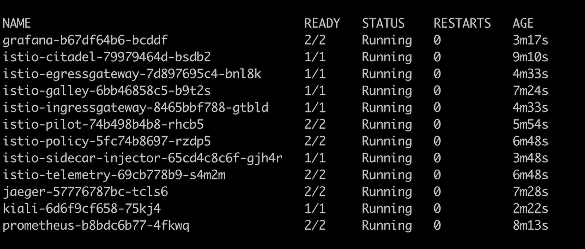

  Watch pods by Web Console, naviage to: Workloads -> Pods

  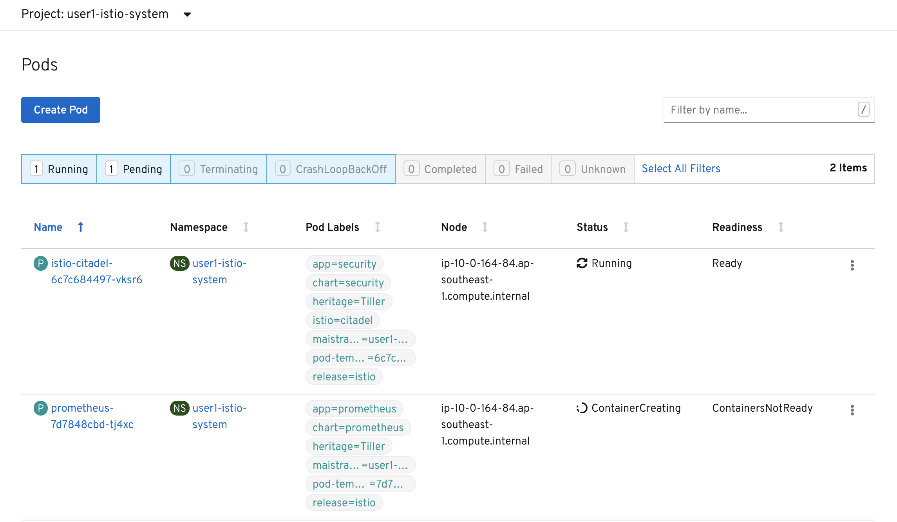

## Service Mesh Member Roll
The Service Mesh operator has installed a control plane configured for multitenancy. This installation reduces the scope of the control plane to only those projects/namespaces listed in a ServiceMeshMemberRoll.

In this section of the lab, you create a ServiceMeshMemberRoll resource with the project/namespaces you wish to be part of the mesh. This ServiceMeshMemberRoll is required to be named default and exist in the same namespace where the ServiceMeshControlPlane resource resides (ie: $USERID-istio-system).

Sample Service Mesh Member Roll [Member Roll](../install/memberroll.yml) for project name "user1"

**Remark: You need to change member to your User ID (ie: $USERID)**

```
apiVersion: maistra.io/v1
kind: ServiceMeshMemberRoll
metadata:
  name: default
spec:
  members:
  - user1

```

Create member roll by oc command

```
oc apply -f install/memberroll.yml -n $USERID-istio-system
```

By Web Console, navigate to: Operators -> Installed Operators then select Red Hat OpenShift Service Mesh and Select Create Instance under Istio Service Member Roll
Change member to your User ID (:ie user1) then select Create

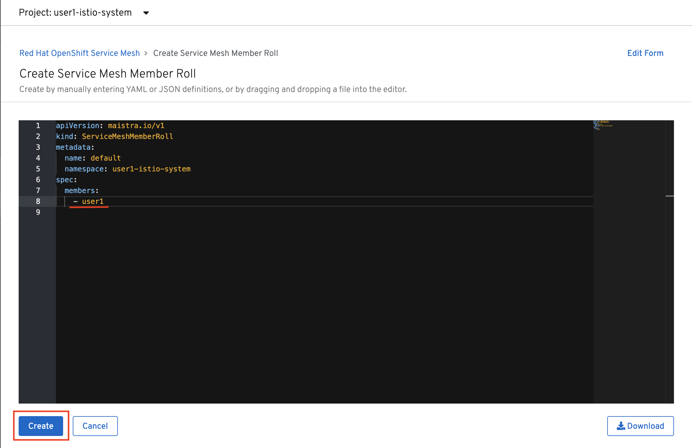

Verify that member roll is created

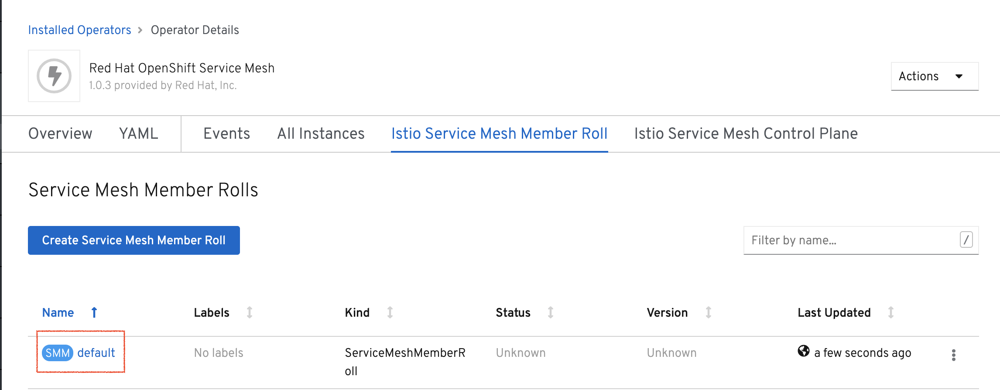

