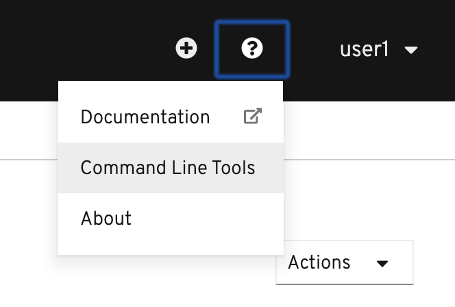
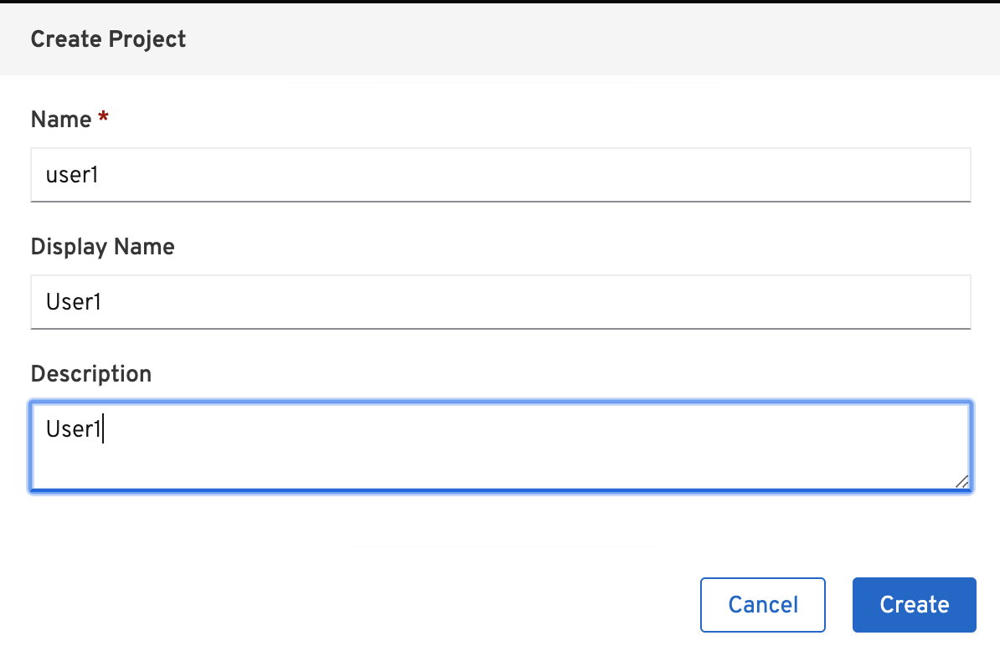

# Red Hat OpenShift Service Mesh Control Plane Lab

Use the Red Hat OpenShift Service Mesh operator to deploy a multi-tenant Service Mesh

## Setup

Configure Control Plane including

* Configure Control Plane
* Configure project(s) or namespace(s) to be part of Service Mesh

Following command line tools are needed for lab

* OpenShift Command Line Interface (CLI - oc command) 
* cURLs
* git (optional)
  
OpenShift Web Console provided link in the top right of page to download oc command here.



You can  also  download oc tool and cURL for OSX and Windows here => [Link](https://1drv.ms/u/s!ArOxOqm_sB7DiSYninA0Aqd6a-kU?e=zsJMGn)

## Setup

### Environment Variables/Login to OpenShift
Setup environment variables
```
export USERID=<your user ID> 

```
For Windows
```
set USERID=<your user ID>
```

Login to OpenShift with oc command by
```
oc login --username=$USERID --server=<URL to OpenShift API>

```
For Windows
```
oc login --username=%USERID% --server=<URL to OpenShift API> 
```

Use your browser login to OpenShift Web Admin Console

### Projects
Create projects (namespace) for Service Mesh's control plane and your applications (for testing)
```
oc new-project $USERID-istio-system --display-name="User1 Istio System"
oc new-project $USERID 

```

You can also use OpenShift Web Admin Console to create Project by select new project from top-left menu then create your project
**Remark: replace user1 with your user ID**

Control Plane


Application



### Labs Content
Clone labs content to your working directory. Open your terminal (For OSX terminal, iTerm2, etc and CMD for Windows) then run following command

```
git clone https://gitlab.com/workshop6/service-mesh.git

```
If you don't have git, click this Link =>[Service Mesh Workshop](https://gitlab.com/workshop6/service-mesh)

Download labs content by click following icon.


## Create Service Mesh Control Plane
Now that the Service Mesh Operator has been installed, you can now install a Service Mesh control plane.
The previously installed Service Mesh operator watches for a ServiceMeshControlPlane resource in all namespaces. Based on the configurations defined in that ServiceMeshControlPlane, the operator creates the Service Mesh control plane.

In this section of the lab, you define a ServiceMeshControlPlane and apply it to your **$USERID-istio-system namespace**.


  
* Install Control Plane using the custom resource file [basic install](../install/basic-install.yml)
    Mutual TLS is disbled by setting mtls to false.
    Kiali user is single sign-on with OpenShift
* Create the service mesh control plane in the istio-system project from [basic-install.yml](../install/basic-install.yml)
  By oc command
  ```
  oc apply -f install/basic-install.yml -n $USERID-istio-system
  ```
  By Web Console, navigate to: Operators -> Installed Operators then select Red Hat OpenShift Service Mesh

  

  Select Create Instance under Istio Service Mesh Control Plane

  

  Copy and paste custom resource file [basic install](../install/basic-install.yml) to YAML section then click Create

  


* Watch the process of deployment
  
  ```
  watch oc get pods -n $USERID-istio-system
  ```
  
  The entire installation process can take approximately 10-15 minutes. Confirm that following pods are up and running
  
  

  Watch pods by Web Console, naviage to: Workloads -> Pods

  

  **Remark: Total number of pods is 12**

## Service Mesh Member Roll
The Service Mesh operator has installed a control plane configured for multitenancy. This installation reduces the scope of the control plane to only those projects/namespaces listed in a ServiceMeshMemberRoll.

In this section of the lab, you create a ServiceMeshMemberRoll resource with the project/namespaces you wish to be part of the mesh. This ServiceMeshMemberRoll is required to be named default and exist in the same namespace where the ServiceMeshControlPlane resource resides (ie: $USERID-istio-system).

Sample Service Mesh Member Roll [Member Roll](../install/memberroll.yml) for project name "user1"

**Remark: You need to change member to your User ID (ie: $USERID)**

```
apiVersion: maistra.io/v1
kind: ServiceMeshMemberRoll
metadata:
  name: default
spec:
  members:
  - user1

```

Create member roll by oc command

```
oc apply -f install/memberroll.yml -n $USERID-istio-system
```

By Web Console, navigate to: Operators -> Installed Operators then select Red Hat OpenShift Service Mesh and Select Create Instance under Istio Service Member Roll
Change member to your User ID (:ie user1) then select Create


Verify that member roll is created


