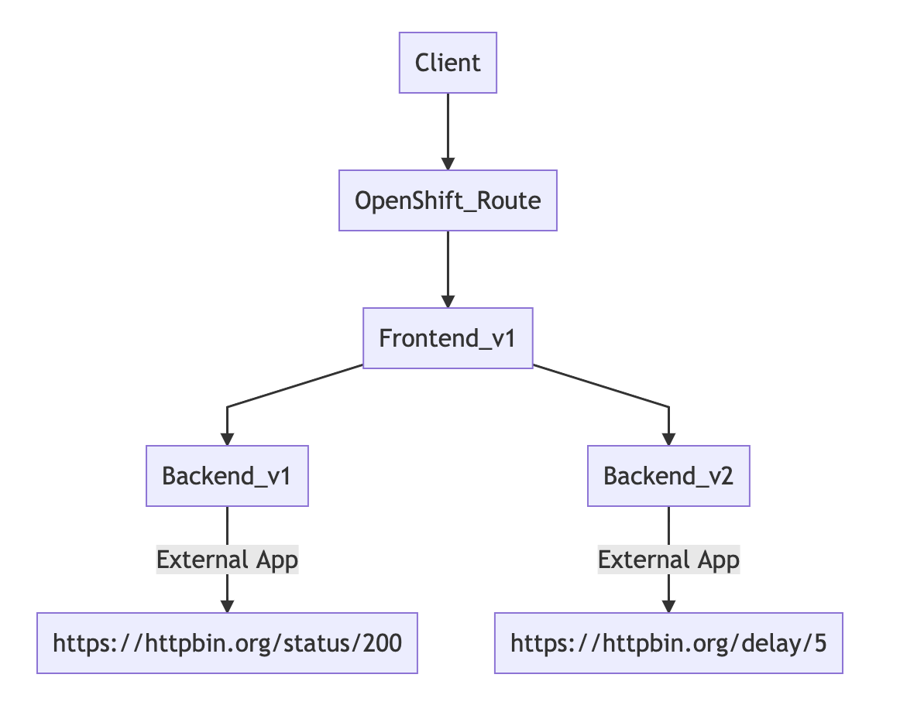

# Microservices Deployment Lab
Deploy microservices applications to OpenShift Container Platform 
Observe automatic injection of Service Mesh sidecar into each microservice

There are two microservices in this lab that you will deploy to OpenShift. In a later lab of this course, you will manage the interactions between these microservices using Red Hat OpenShift Service Mesh.


<!-- ## Setup


Istio need priviledged acess to run 
*** internal use: need to add RBAC for userXX to have rights to run following command
```
oc adm policy add-scc-to-user anyuid -z default -n $USERID
oc adm policy add-scc-to-user privileged  -z default -n $USERID


``` -->

## Deploy Frontend and Backend app
You start by deploying the catalog service to RHOCP. The sidecar proxy is automatically injected by annotated deployment with 


```
sidecar.istio.io/inject: "true"

```

Check for annotation section in deployment config file.
```
...
spec:
  replicas: 1
  template:
    metadata:
      labels:
        app: backend
        version: v1
      annotations:
        sidecar.istio.io/inject: "true"
...
```
Review deployment of backend v1 and v2. Backend v2 with delay 5 sec

```
...
env:
          - name: BACKEND_URL
            value: https://httpbin.org/delay/5
...
```
### Deploy the backend app
```
oc apply -f ocp/backend-v1-deployment.yml -n $USERID
oc apply -f ocp/backend-v2-deployment.yml -n $USERID
oc apply -f ocp/backend-service.yml -n $USERID

```

Sample outout
```
deployment.extensions/backend-v1 created
deployment.extensions/backend-v2 created
service/backend created

```

Monitor the deployment of the pods:
```
oc get pods -w -n $USERID

```
Wait until the Ready column displays 2/2 pods and the Status column displays Running:
Press Control-C to exit.

### Deploy the frontend app
Deploy the backend app and create service:
```
oc apply -f ocp/frontend-v1-deployment.yml -n $USERID
oc apply -f ocp/frontend-service.yml -n $USERID
oc apply -f ocp/frontend-route.yml -n $USERID
```

Sample outout
```
deployment.extensions/frontend created
service/frontend created
route.route.openshift.io/frontend created

```

Monitor the deployment of the pods:
```
watch oc get pods -n $USERID
or
oc get pods -w -n $USERID

```
Wait until the Ready column displays 2/2 pods and the Status column displays Running:

### Test
Test frontend app by

```
export FRONTEND_URL=http://$(oc get route frontend -n $USERID -o jsonpath='{.status.ingress[0].host}')
curl $FRONTEND_URL

```

Sample outout
```
Frontend version: v1 => [Backend: http://backend:8080, Response: 200, Body: Backend version:v1,Response:200,Host:backend-v1-6ddf9c7dcf-pppzc, Message: Hello World!!]

# Frontend version v1 call Backend with URL http://backend:8080
# Response code is 200
# Backend is version 1.0.0 and respond from pod backend-v1-66f48cff87-gcfxz
# Response message from Backend is Hello World!!

```

Verify that backend service selector is set to just app label.
```
...
  selector:
    app: backend
...  

```

Try to run curl command again and check that response from backend will round-robin between v1 and v2 and v2 is elapsed time is slightly more than 5 sec.


You also can use following cURL for check response time

```
curl $FRONTEND_URL -s -w "\nElapsed Time:%{time_total}"

```

Sample output
```
Frontend version: v1 => [Backend: http://backend:8080, Response: 200, Body: Backend version:v2,Response:200,Host:backend-v2-7655885b8c-5spv4, Message: Hello World!!]
Elapsed Time:6.106281
```