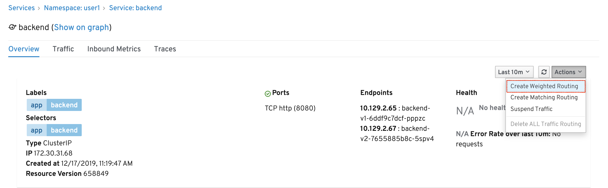
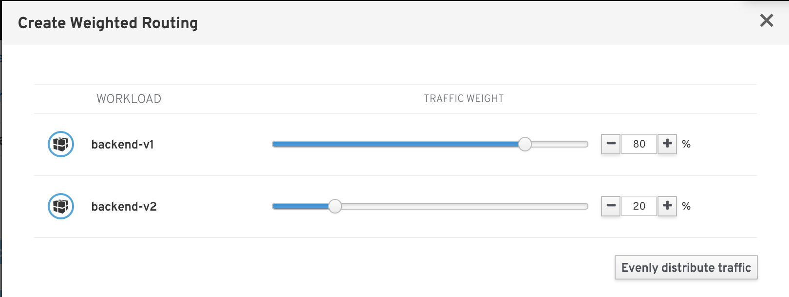
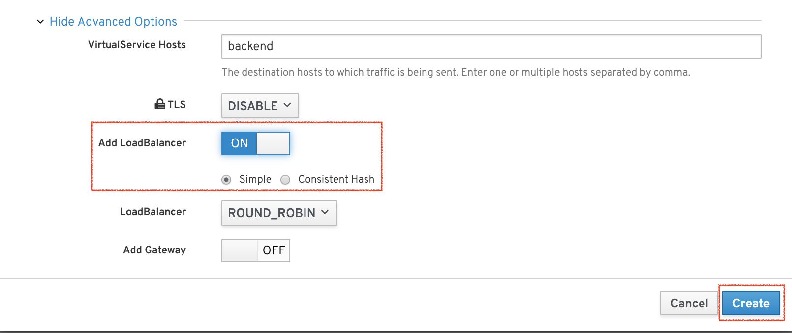
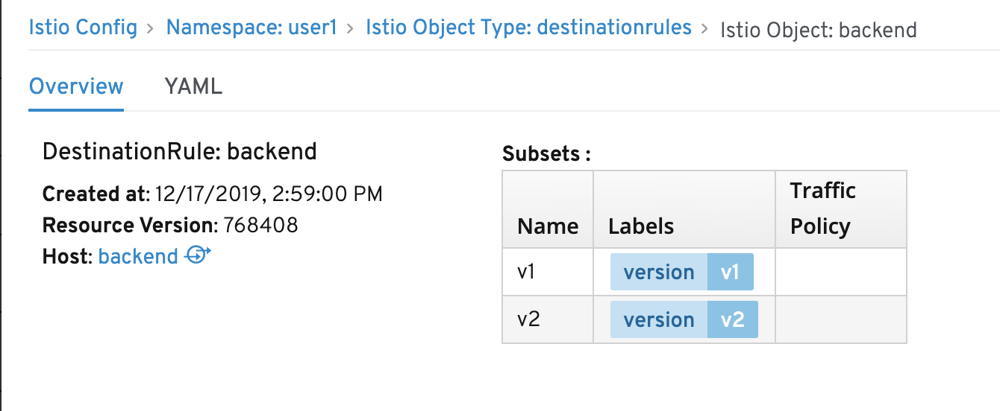
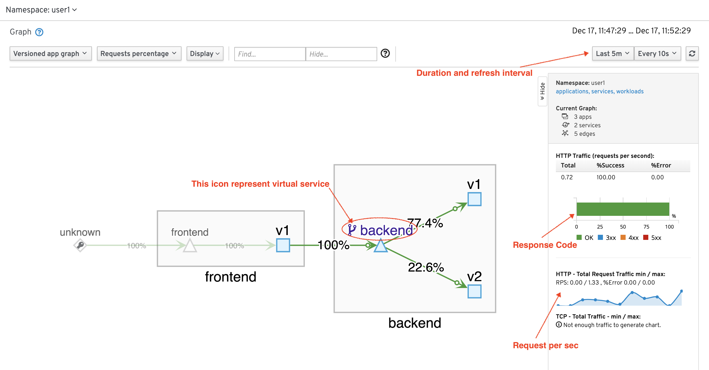
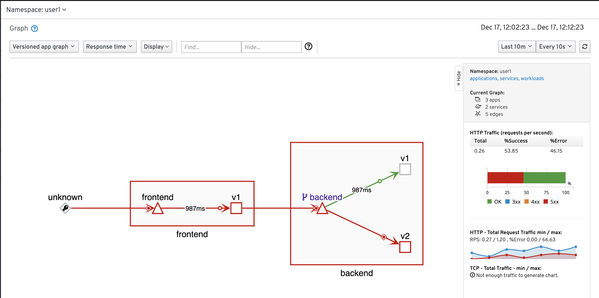

# Dynamic Routing Lab

Configure service mesh route rules to dynamically route and shape traffic between services


## Traffic Management
Routing within Service Mesh can be controlled by using Virtual Service and Routing Rules.

Service Mesh Route rules control how requests are routed within service mesh.

Requests can be routed based on the source and destination, HTTP header fields, and weights associated with individual service versions. For example, a route rule could route requests to different versions of a service.

VirtualService defines a set of traffic routing rules to apply when a host is addressed. Each routing rule defines matching criteria for traffic of a specific protocol. If the traffic is matched, then it is sent to a named destination service (or subset/version of it) defined in the registry. The source of traffic can also be matched in a routing rule. This allows routing to be customized for specific client contexts.

DestinationRule defines policies that apply to traffic intended for a service after routing has occurred. These rules specify configuration for load balancing, connection pool size from the sidecar, and outlier detection settings to detect and evict unhealthy hosts from the load-balancing pool.

## Traffic splitting by Percentage
### Destination Rule
Review the following Istio's destination rule configuration file [destination-rule-backend-v1-v2.yml](../istio-files/destination-rule-backend-v1-v2.yml)  to define subset called v1 and v2 by matching label "app" and "version"

**Remark: If you don't like to edit YAML file, You can try using [Kiali Console to create Istio policy](#routing-policy-with-kiali-console)**

```
apiVersion: networking.istio.io/v1alpha3
kind: DestinationRule
metadata:
  name: backend
spec:
  host: backend
  subsets:
  - name: v1
    labels:
      app: backend
      version: v1
    trafficPolicy:
      loadBalancer:
        simple: ROUND_ROBIN
  - name: v2
    labels:
      app: backend
      version: v2
    trafficPolicy:
      loadBalancer:
        simple: ROUND_ROBIN
```
### Virtual Service
Review the following Istio's  virtual service configuration file [virtual-service-backend-v1-v2-80-20.yml](../istio-files/virtual-service-backend-v1-v2-80-20.yml) to route 80% of traffic to version v1 and 20% of traffic to version v2

```
apiVersion: networking.istio.io/v1alpha3
kind: VirtualService
metadata:
  name: backend-virtual-service
spec:
  hosts:
  - backend
  http:
  - route:
    - destination:
        host: backend
        subset: v1
      weight: 80
    - destination:
        host: backend
        subset: v2
      weight: 20
```

### Apply Istio Policy for A/B deployment
Run oc apply command to apply Istio policy.

```
oc apply -f istio-files/destination-rule-backend-v1-v2.yml -n $USERID
oc apply -f istio-files/virtual-service-backend-v1-v2-80-20.yml -n $USERID

```

Sample outout
```
destinationrule.networking.istio.io/backend created
virtualservice.networking.istio.io/backend-virtual-service created

```
### Routing Policy with Kiali Console 
Login to the Kiali web console. Select "Services" on the left menu. Then select backend service

On the main screen of backend service. Click Action menu on the top right and select "Create Weighted Routing"



Use slider bar or input weight 


Click "Show Advanced Options" to explore more options


Click Create to create Destination Rule and Virtual Service. Then view result by select Virtual Service and Destination Rule on the bottom section of page.

Example of Virtual Service configuration


Example of Destination Rule configuration


Remark: You can view YAML by click "YAML" tab


### Test
Test A/B deployment by run [run-50.sh](../scripts/run-50.sh)
```
scripts/run-50.sh

```

Sample output

```
...
Backend:v1, Response Code: 200, Host:backend-v1-6ddf9c7dcf-pppzc, Elapsed Time:0.890935 sec
Backend:v1, Response Code: 200, Host:backend-v1-6ddf9c7dcf-pppzc, Elapsed Time:1.084210 sec
Backend:v1, Response Code: 200, Host:backend-v1-6ddf9c7dcf-pppzc, Elapsed Time:0.952610 sec
Backend:v2, Response Code: 200, Host:backend-v2-7655885b8c-5spv4, Elapsed Time:5.823382 sec
Backend:v2, Response Code: 200, Host:backend-v2-7655885b8c-5spv4, Elapsed Time:5.805121 sec
Backend:v1, Response Code: 200, Host:backend-v1-6ddf9c7dcf-pppzc, Elapsed Time:0.778479 sec
Backend:v1, Response Code: 200, Host:backend-v1-6ddf9c7dcf-pppzc, Elapsed Time:0.856198 sec
Backend:v2, Response Code: 200, Host:backend-v2-7655885b8c-5spv4, Elapsed Time:5.993813 sec
Backend:v1, Response Code: 200, Host:backend-v1-6ddf9c7dcf-pppzc, Elapsed Time:0.787655 sec
========================================================
Total Request: 50
Version v1: 39
Version v2: 11
========================================================
```
You can also check this splitting traffic with Kiali console by select Graph on left menu.


## Timeout
We can also add timeout to Virtual Service configuration. Currently backend v2 is response in 6 sec. We will set Virtual Service to wait for 3 sec. If frontend wait more than 3 sec, frontend will received HTTP response with Gateway Timeout (504).

Review the following Istio's  virtual service configuration file [virtual-service-backend-v1-v2-50-50-3s-timeout.yml](../istio-files/virtual-service-backend-v1-v2-50-50-3s-timeout.yml) to set timeout to 3 sec

```
apiVersion: networking.istio.io/v1alpha3
kind: VirtualService
metadata:
  name: backend-virtual-service
spec:
  hosts:
  - backend
  http:
  - timeout: 3s
    route:
    - destination:
        host: backend
        subset: v1
      weight: 50
    - destination:
        host: backend
        subset: v2
      weight: 50
```

Run oc apply command to apply Istio policy.

```
oc apply -f istio-files/destination-rule-backend-v1-v2.yml -n $USERID
oc apply -f istio-files/virtual-service-backend-v1-v2-50-50-3s-timeout.yml -n $USERID

```

Sample outout
```
destinationrule.networking.istio.io/backend created
virtualservice.networking.istio.io/backend-virtual-service created

```

Test again with cURL and check for 504 response code from backend version v2
```
curl $FRONTEND_URL
```

Result
```
Frontend version: v1 => [Backend: http://backend:8080, Response: 504, Body: upstream request timeout]
```

Run [run-50.shj](../scripts/run-50.sh)

```
scripts/run-50.sh
```

Sample output
```
...
Backend:v1, Response Code: 200, Host:backend-v1-6ddf9c7dcf-pppzc, Elapsed Time:0.774024 sec
Backend:, Response Code: 504, Host:, Elapsed Time:3.193873 sec
Backend:v1, Response Code: 200, Host:backend-v1-6ddf9c7dcf-pppzc, Elapsed Time:0.787584 sec
Backend:, Response Code: 504, Host:, Elapsed Time:3.724406 sec
Backend:, Response Code: 504, Host:, Elapsed Time:3.147017 sec
Backend:, Response Code: 504, Host:, Elapsed Time:3.207459 sec
========================================================
Total Request: 50
Version v1: 25
Version v2: 0
========================================================
...
```

Check Graph in Kiali Console with Response time.


## Remove Istio Policy
Run oc delete command to remove Istio policy.

```
oc delete -f istio-files/virtual-service-backend-v1-v2-80-20.yml -n $USERID
oc delete -f istio-files/destination-rule-backend-v1-v2.yml -n $USERID

```

You can also remove Istio policy by using Kiali Console by select Istio Config menu on the left then select each configuration and select menu Action on the upper right of page. Then click Delete
