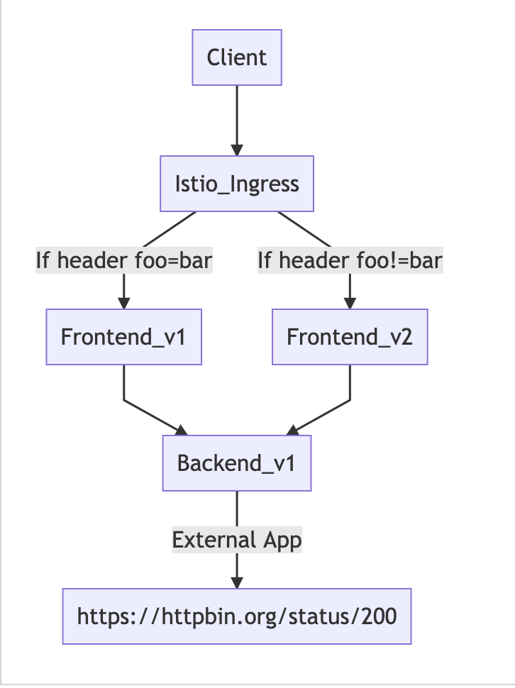

# Istio Gateway and Routing by HTTP header

Configure service mesh gateway to control traffic that entering mesh.


## Setup
Deploy frontend v2 and remove backend v2

```
oc apply -f ocp/frontend-v2-deployment.yml -n $USERID
oc delete -f ocp/backend-v2-deployment.yml -n $USERID
watch oc get pods -n $USERID # or using oc get pods -w -n $USERID
```

## Gateway
Review the following Istio's Gateway rule configuration file [ingress-gateway.yml](../istio-files/ingress-gateway.yml)  to create Istio Gateway.

Run oc apply command to create Istio Gateway.
```
oc apply -f istio-files/frontend-gateway.yml -n $USERID
```

Sample outout
```
gateway.networking.istio.io/frontend-gateway created
```

**Remark: You can also using [Kiali Console to create Gateway](#create-gateway-using-kiali-console)**


## Routing by incoming HTTP header
### Destination Rule
Review the following Istio's destination rule configuration file [destination-rule-frontend-v1-v2.yml](../istio-files/destination-rule-frontend-v1-v2.yml)  to define subset called v1 and v2 by matching label "app" and "version"

Run oc apply command to create Istio Gateway.
```
oc apply -f istio-files/destination-rule-frontend-v1-v2.yml -n $USERID
```

Sample outout
```
destinationrule.networking.istio.io/frontend created
```

### Virtual Service
Review the following Istio's  virtual service configuration file [virtual-service-frontend-header-foo-bar-to-v1.yml](../istio-files/virtual-service-frontend-header-foo-bar-to-v1.yml) to routing request to v1 if request container header name foo with value bar

```
...
- match:
    - headers:
        foo:
          exact: bar
    route:
    - destination:
        host: frontend
        subset: v1
...
```

Run oc apply command to apply Istio virtual service policy.
```
oc apply -f istio-files/virtual-service-frontend-header-foo-bar-to-v1.yml -n $USERID
```

Sample output
```
virtualservice.networking.istio.io/frontend created
```
<!-- ## Create Gateway using Kiali Console
Login to the Kiali web console. Select "Services" on the left menu. Then select frontend service

* On the main screen of backend service. Click Action menu on the top right and select "Create Matching Routing"


* Input Header name foo to exact match with value bar and then add rule


* Verify that header matching rule is added.


* Add Gateway by enable Advanced Option then select Add Gateway  -->

### Test
Get URL of Istio Gateway and set to environment variable by using following command
```
export GATEWAY_URL=$(oc -n $USERID-istio-system get route istio-ingressgateway -o jsonpath='{.spec.host}')

```
Verify that environment variable GATEWAY is set correctly.
```
echo $GATEWAY
```
Sample output
```
istio-ingressgateway-user1-istio-system.apps.cluster-bkk77-eeb3.bkk77-eeb3.example.opentlc.com
```

Test with cURL by setting header name foo with value bar. Response will always from Frontend v1
```
curl -v -H foo:bar $GATEWAY_URL
```
Sample outout
```
Frontend version: v1 => [Backend: http://backend:8080, Response: 200, Body: Backend version:v2,Response:200,Host:backend-v2-7655885b8c-b7nf2, Message: Hello World!!]
```
Test again witout specified parameter -H. Response will always from Frontend v2
Sample outout
```
Frontend version: v2 => [Backend: http://backend:8080, Response: 200, Body: Backend version:v2,Response:200,Host:backend-v2-7655885b8c-b7nf2, Message: Hello World!!]
```

## Remove Istio Policy
Run oc delete command to remove Istio policy.

```
oc delete -f istio-files/frontend-gateway.yml -n $USERID
oc delete -f istio-files/destination-rule-frontend-v1-v2.yml -n $USERID
oc delete -f istio-files/virtual-service-frontend-header-foo-bar-to-v1.yml -n $USERID

```