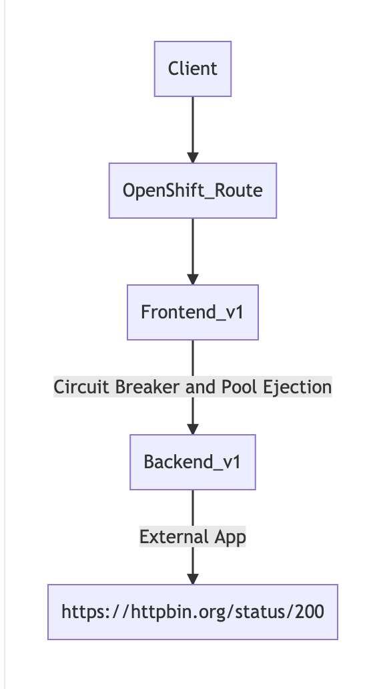
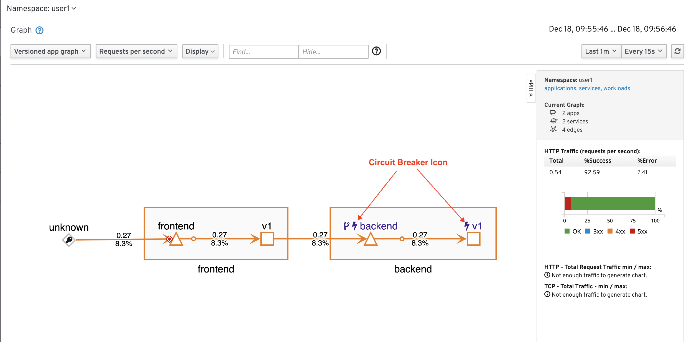

# Service Resilience by Circuit Breaker Lab


## Setup
Setup microservices app as follow:



Remove backend-v2 and scale backend-v1 to 3 pods
```
oc delete -f ocp/backend-v2-deployment.yml -n $USERID
oc scale deployment backend-v1 --replicas=3 -n $USERID
watch oc get pods -n $USERID
# Wait until all backend-v1 pods status are Runnings and all container in pods are ready (2/2)
```
Sample output
```
NAME                          READY   STATUS    RESTARTS   AGE
backend-v1-6ddf9c7dcf-sqxqz   2/2     Running   0          8h
backend-v1-6ddf9c7dcf-vm6kb   2/2     Running   0          8h
backend-v1-6ddf9c7dcf-x6gkh   2/2     Running   0          8h
frontend-v1-655f4478c-wn7wr   2/2     Running   0          9h
```


We will force one backend-v1 pod to return 504. This can be done by rsh into pod the curl to /stop (backend-v1 will always return 504 after receiving /stop. This is for demo)

Select one pod and rsh into pod by using following oc command
```
oc rsh <pod name> -n $USERID
# After you get prompt run following command
curl http://localhost:8080/stop
exit
```

Test with [run50.sh](../scripts/run-50.sh) and check that with averagely 3 requests 1 request will response with response code 504
```
scripts/run-50.sh
```

Sample output
```
Backend:v1, Response Code: 200, Host:backend-v1-6ddf9c7dcf-x6gkh, Elapsed Time:1.132765 sec
Backend:v1, Response Code: 504, Host:, Elapsed Time:0.134960 sec
Backend:v1, Response Code: 200, Host:backend-v1-6ddf9c7dcf-sqxqz, Elapsed Time:1.022941 sec
Backend:v1, Response Code: 504, Host:, Elapsed Time:0.117325 sec
Backend:v1, Response Code: 200, Host:backend-v1-6ddf9c7dcf-x6gkh, Elapsed Time:0.787738 sec
Backend:v1, Response Code: 200, Host:backend-v1-6ddf9c7dcf-sqxqz, Elapsed Time:1.004579 sec
Backend:v1, Response Code: 504, Host:, Elapsed Time:0.114131 sec
Backend:v1, Response Code: 200, Host:backend-v1-6ddf9c7dcf-x6gkh, Elapsed Time:0.964214 sec
Backend:v1, Response Code: 200, Host:backend-v1-6ddf9c7dcf-sqxqz, Elapsed Time:1.043541 sec
Backend:v1, Response Code: 504, Host:, Elapsed Time:0.122031 sec
```

## Circuit Breaker and Pool Ejection
Review the following Istio's destination rule configuration file [destination-rule-backend-circuit-breaker-with-pool-ejection.yml](../istio-files/destination-rule-backend-circuit-breaker-with-pool-ejection.yml)  to define circuit breaker and pool ejection with following configuration.

```
...
outlierDetection:
        baseEjectionTime: 15m
        consecutiveErrors: 1
        interval: 10m
        maxEjectionPercent: 100
# In plain english as follow:
# If backend is response with 5xx for 1 times. (consecutiveErrors: 1)
# that pod will eject from pool for 15 minutes. (baseEjectionTime: 15m)
# and all pods can be ejected. (maxEjectionPercent: 100)
# This will check again in 10 minutes. (interval: 10m)
```

Apply destination rule and virtual service to backend service
```
oc apply -f istio-files/destination-rule-backend-circuit-breaker-with-pool-ejection.yml -n $USERID
oc apply -f istio-files/virtual-service-backend.yml -n $USERID
```

Sample output
```
destinationrule.networking.istio.io/backend created
virtualservice.networking.istio.io/backend-virtual-service created
```

## Test
Run [run-50.sh](../scripts/run-50.sh) again and check for output.
After first response with 504. Circuit will break and that pod will be ejected from pool.
Sample output
```
Backend:v1, Response Code: 200, Host:backend-v1-6ddf9c7dcf-x6gkh, Elapsed Time:1.215202 sec
Backend:v1, Response Code: 504, Host:, Elapsed Time:0.132040 sec
Backend:v1, Response Code: 200, Host:backend-v1-6ddf9c7dcf-x6gkh, Elapsed Time:1.258287 sec
Backend:v1, Response Code: 200, Host:backend-v1-6ddf9c7dcf-sqxqz, Elapsed Time:0.964190 sec
Backend:v1, Response Code: 200, Host:backend-v1-6ddf9c7dcf-x6gkh, Elapsed Time:1.000230 sec
Backend:v1, Response Code: 200, Host:backend-v1-6ddf9c7dcf-sqxqz, Elapsed Time:0.987716 sec
Backend:v1, Response Code: 200, Host:backend-v1-6ddf9c7dcf-x6gkh, Elapsed Time:1.110361 sec
Backend:v1, Response Code: 200, Host:backend-v1-6ddf9c7dcf-sqxqz, Elapsed Time:1.115050 sec
...
...
Backend:v1, Response Code: 200, Host:backend-v1-6ddf9c7dcf-sqxqz, Elapsed Time:1.114086 sec
Backend:v1, Response Code: 200, Host:backend-v1-6ddf9c7dcf-x6gkh, Elapsed Time:1.002835 sec
Backend:v1, Response Code: 200, Host:backend-v1-6ddf9c7dcf-sqxqz, Elapsed Time:1.059931 sec
========================================================
Total Request: 50
Version v1: 49
Version v2: 0
========================================================
...
```
You can also check Kiali console graph


## Clean Up
Run oc delete command to remove Istio policy.

```
oc delete -f istio-files/destination-rule-backend-circuit-breaker-with-pool-ejection.yml -n $USERID
oc delete -f istio-files/virtual-service-backend.yml -n $USERID
```

Remove all pods
```
oc delete -f ocp/backend-v1-deployment.yml -n $USERID
oc delete -f ocp/backend-service.yml -n $USERID
oc delete -f ocp/frontend-v1-deployment.yml -n $USERID
oc delete -f ocp/frontend-service.yml -n $USERID
oc delete -f ocp/frontend-route.yml -n $USERID
```
